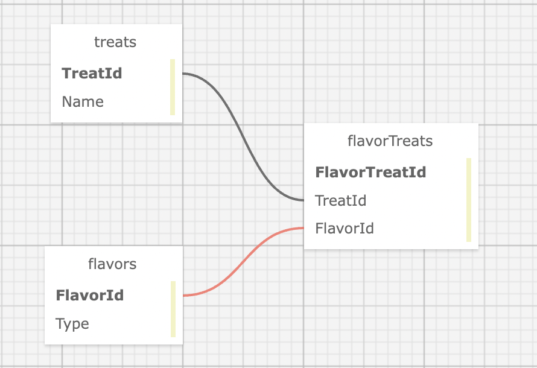

# Bakery Treats

#### By Kirsten Opstad

#### A web app to market sweet and savory treats for a fictional bakery

## Technologies Used

* C#
* .Net 6
* ASP.Net Core 6 MVC
* EF Core 6
* SQL
* MySQL
* LINQ
* Identity

## Description

A student project demonstrating knowledge about user authentication, authorization and many-to-many relationships.

### Objectives (MVP)

#### Required Features
* ✅ The application should have user authentication. A user should be able to log in and log out. Only logged in users should have create, update, and delete functionality. All users should be able to have read functionality.
* ✅ There should be a many-to-many relationship between Treats and Flavors. A treat can have many flavors (such as sweet, savory, spicy, or creamy) and a flavor can have many treats. For instance, the "sweet" flavor could include chocolate croissants, cheesecake, and so on.
* ✅ A user should be able to navigate to a splash page that lists all treats and flavors. Users should be able to click on an individual treat or flavor to see all the treats/flavors that belong to it.

Additionally, code will be reviewed on the following: 
* ✅ Does at least one of your classes have all CRUD methods implemented in your app? (Flavors, Treats)
* ✅ Are you able to view both sides of the many-many relationship? For a particular instance of a class, are you able to view all of the instances of the other class that are related to it?
* ✅ Are users able to register, log in and log out with Identity?
* ✅ Is Create, Update and Delete functionality limited to authenticated users?
* ✅ Build files and sensitive information are included in .gitignore file and are not in Git history, and includes instructions on how to create the appsettings.json and set up the project.
* ✅ Project is in a polished, portfolio-quality state.
* ✅ The prompt’s required functionality and baseline project requirements are in place by the deadline.



<!-- [Link to operational site](http://www.kirstenopstad.github.com/<REPOSITORY NAME>) -->

### Goals
1. ✅ Meet MVP
2. ✅ Add basic styling
3. Stretch: Have separate roles for admins and logged-in users. Only admins should be able to add, update and delete.
4. Stretch: Add an order form that only logged-in users can access. A logged-in user should be able to create, read, update and delete their own order.
6. Strech: Add functionality of Bakery

## Setup/Installation Requirements

1. Navigate to the `Bakery` directory.
2. Create a file named `appsettings.json` with the following code. Be sure to update the Default Connection to your MySQL credentials.
```
{
  "ConnectionStrings": {
    "DefaultConnection": "Server=localhost;Port=3306;database=Bakery;uid=[YOUR-USERNAME-HERE];pwd=[YOUR-PASSWORD-HERE];",
  }
}
```
3. Install dependencies within the `Bakery` directory
```
$ dotnet restore
```

4. To build a local database
```
$ dotnet ef database update
```

5. To build & run program in development mode 
 ```
 $ dotnet run
 ```

6. To build & run program in production mode 
 ```
 dotnet run --launch-profile "production"
 ```

## Known Bugs

* No known bugs. If you find one, please email me at kirsten.opstad@gmail.com with the subject **[_Repo Name_] Bug** and include:
  * BUG: _A brief description of the bug_
  * FIX: _Suggestion for solution (if you have one!)_
  * If you'd like to be credited, please also include your **_github user profile link_**

## License

MIT License

Copyright (c) 2023 Kirsten Opstad 

Permission is hereby granted, free of charge, to any person obtaining a copy of this software and associated documentation files (the "Software"), to deal in the Software without restriction, including without limitation the rights to use, copy, modify, merge, publish, distribute, sublicense, and/or sell copies of the Software, and to permit persons to whom the Software is furnished to do so, subject to the following conditions:

The above copyright notice and this permission notice shall be included in all copies or substantial portions of the Software.

THE SOFTWARE IS PROVIDED "AS IS", WITHOUT WARRANTY OF ANY KIND, EXPRESS OR IMPLIED, INCLUDING BUT NOT LIMITED TO THE WARRANTIES OF MERCHANTABILITY, FITNESS FOR A PARTICULAR PURPOSE AND NONINFRINGEMENT. IN NO EVENT SHALL THE AUTHORS OR COPYRIGHT HOLDERS BE LIABLE FOR ANY CLAIM, DAMAGES OR OTHER LIABILITY, WHETHER IN AN ACTION OF CONTRACT, TORT OR OTHERWISE, ARISING FROM, OUT OF OR IN CONNECTION WITH THE SOFTWARE OR THE USE OR OTHER DEALINGS IN THE SOFTWARE.
